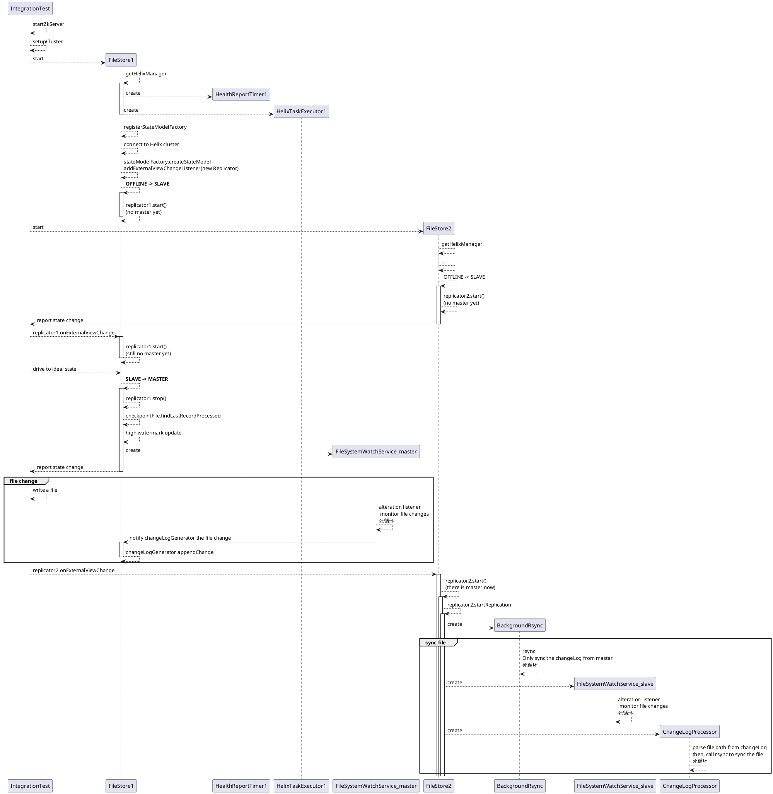

# Thread Model

Notes:

1. Replicator is a RoutingTableProvider (Spectator) 因为要查找其他instance
2. When a Participant is interrupted, there could be no chance to execute the state transition like `MASTER->SLAVE`, the process just aborts.
3. If FileStore1 is down, FileStore2 will become the new Master, and it will stop the `replicator` first, which will shutdown the original `backgroundRsync`, `FSWatchService_slave` and `ChangeLogProcessor` threads first.